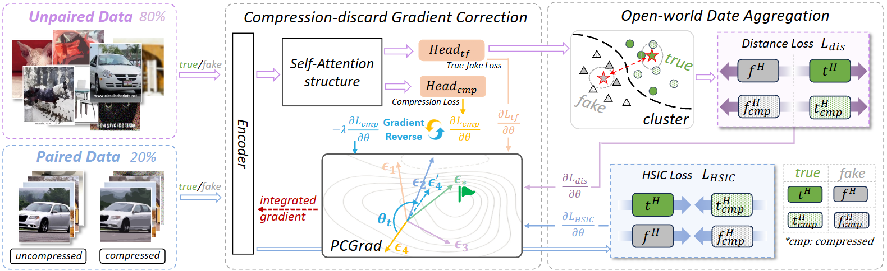
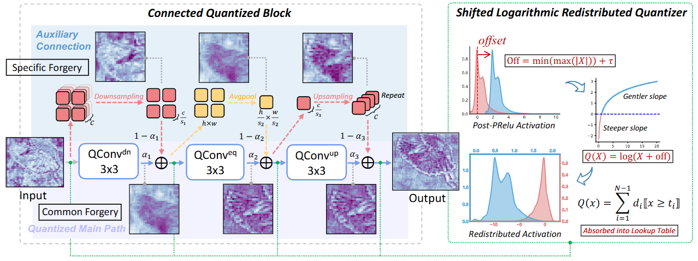
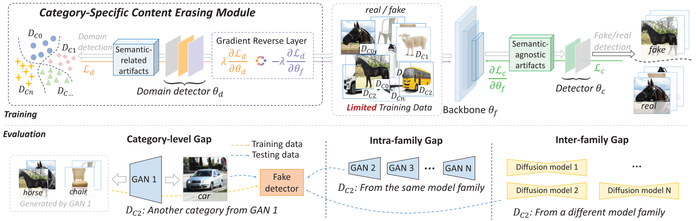
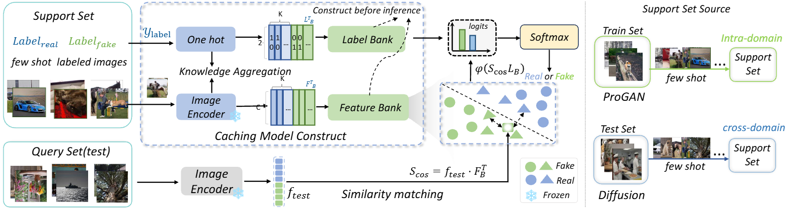
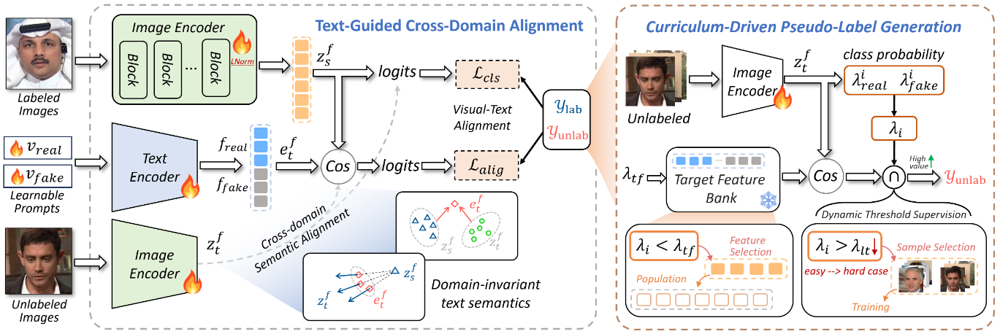

# AIGC Detection Method Papers

This is the summary page for method-oriented papers on AIGC detection from our [RST-Lab](https://rstao-bjtu.github.io/people/) research group at Beijing Jiaotong University. We focus on reliable detection methods for increasingly realistic AI-generated content and hope these works can support further research in the community.

## Table of Contents

- [Introduction](#introduction)
- [News](#news)
- [Method Papers](#method-papers)
  - [ODDN](#oddn-addressing-unpaired-data-challenges-in-open-world-deepfake-detection-on-online-social-networks)
  - [QMDD](#unlocking-the-potential-of-lightweight-quantized-models-for-deepfake-detection)
  - [SAGNet](#sagnet-decoupling-semantic-agnostic-artifacts-from-limited-training-data-for-robust-generalization-in-deepfake-detection)
  - [FTNet](#leveraging-failed-samples-a-few-shot-and-training-free-framework-for-generalized-deepfake-detection)
  - [DPGNet](#leveraging-unlabeled-data-from-unknown-sources-via-dual-path-guidance-for-deepfake-face-detection)

## Introduction

With the rapid development of generative models, AIGC detection has become an important research topic for media forensics, platform governance, and trustworthy AI. In real online environments, detection models must handle diverse generation pipelines, image qualities, compression settings, and open-world distribution shifts. This project introduces our studies on method design for AIGC detection. Each paper entry keeps the title, paper link, open-source code, and a concise summary, with a focus on open-world detection, deepfake detection, robust representation learning, and online social networks.

## News

**[2024.12]** Our paper [ODDN](#oddn-addressing-unpaired-data-challenges-in-open-world-deepfake-detection-on-online-social-networks) is accepted by AAAI 2025.

**[2025.04]** Our paper [QMDD](#unlocking-the-potential-of-lightweight-quantized-models-for-deepfake-detection) is accepted by IJCAI 2025.

**[2025.06]** Our paper [SAGNet](#sagnet-decoupling-semantic-agnostic-artifacts-from-limited-training-data-for-robust-generalization-in-deepfake-detection) is accepted by IEEE TIFS.

**[2025.11]** Our paper [FTNet](#leveraging-failed-samples-a-few-shot-and-training-free-framework-for-generalized-deepfake-detection) is accepted by AAAI 2026.

**[2026.02]** Our paper [DPGNet](#leveraging-unlabeled-data-from-unknown-sources-via-dual-path-guidance-for-deepfake-face-detection) is accepted by CVPR 2026.

**[Update]** More AIGC detection method papers will be added here.

## Method Papers

### ODDN: Addressing Unpaired Data Challenges in Open-World Deepfake Detection on Online Social Networks

  

- **Paper:** <https://arxiv.org/abs/2410.18687>
- **PDF:** <https://arxiv.org/pdf/2410.18687>
- **Code:** <https://github.com/ManyiLee/Open-world-Deepfake-Detection-Network>
- **Venue:** AAAI 2025

Despite significant advances in deepfake detection, handling varying image quality, especially due to different compressions on online social networks (OSNs), remains challenging. Current methods succeed by leveraging correlations between paired images, whether raw or compressed. However, in open-world scenarios, paired data is scarce, with compressed images readily available but corresponding raw versions difficult to obtain. This imbalance, where unpaired data vastly outnumbers paired data, often leads to reduced detection performance, as existing methods struggle without corresponding raw images. To overcome this issue, ODDN introduces two core modules: open-world data aggregation (ODA) and compression-discard gradient correction (CGC). ODA aggregates correlations between compressed and raw samples through fine-grained and coarse-grained analyses for paired and unpaired data, respectively. CGC further enhances performance across diverse compression methods in OSNs by optimizing the training gradient so the model remains less sensitive to compression variations. Extensive experiments on 17 popular deepfake datasets demonstrate the superiority of ODDN over state-of-the-art baselines.

[Back to Table of Contents](#table-of-contents)

### Unlocking the Potential of Lightweight Quantized Models for Deepfake Detection

  

- **Paper:** <https://www.ijcai.org/proceedings/2025/0059.pdf>
- **Code:** <https://github.com/rstao-bjtu/QMDD>
- **Venue:** IJCAI 2025

Deepfake detection is increasingly crucial due to the rapid rise of AI-generated content. Existing methods achieve high performance relying on computationally intensive large models, making real-time detection on resource-constrained edge devices challenging. Given that deepfake detection is a binary classification task, there is potential for model compression and acceleration. In this paper, we propose a low-bit quantization framework for lightweight and efficient deepfake detection. The Connected Quantized Block extracts common forgery features via the quantized path and retains method-specific textures through the shortcut connections. Additionally, the Shifted Logarithmic Redistribution Quantizer mitigates information loss in near-zero domains by unfolding the unbalanced activations, enabling finer quantization granularity. Comprehensive experiments demonstrate that this new framework significantly reduces 10.8x computational costs and 12.4x storage requirements while maintaining high detection performance, even surpassing SOTA methods using less than 5% FLOPs, paving the way for efficient deepfake detection in resource-limited scenarios.

[Back to Table of Contents](#table-of-contents)

### SAGNet: Decoupling Semantic-Agnostic Artifacts From Limited Training Data for Robust Generalization in Deepfake Detection

  

- **Paper:** <https://ieeexplore.ieee.org/document/11045799>
- **Code:** <https://github.com/rstao-bjtu/SAGNet/>
- **Venue:** IEEE TIFS

Deepfake detection presents a significant challenge, particularly when the available training data is constrained to a limited set of semantic categories, which is a common and realistic scenario. In deepfake detection, the training labels typically indicate whether an image is real or fake, without specifying the semantic content, such as object classes. Moreover, we cannot know in advance the object categories present in an image to be detected. Ideally, a deepfake detection model should perform consistently across different semantic categories during inference, irrespective of the content. However, existing methods often exhibit significant performance bias between seen and unseen classes, struggling to generalize effectively. To address this issue, we propose Semantic-AGnostic artifact Network (SAGNet), an innovative and efficient approach designed to decouple semantic-agnostic artifacts from content-specific distributions in the training data. Our method eliminates semantic-specific biases, ensuring that the model focuses on universal artifacts related to image authenticity rather than content-dependent features. By employing this decoupling strategy, SAGNet greatly enhances the model's generalization capacity, even when trained on limited data. Remarkably, through experiments, we demonstrate that SAGNet achieves performance comparable to models trained with 10 times more data, despite being trained on only 2 classes. Furthermore, through extensive experiments, we show that SAGNet's improvements are not only evident across different semantic categories but also extend to various generative methods, including multiple GAN-based and diffusion-based models. This cross-method generalization emphasizes SAGNet's versatility and effectiveness in diverse generative scenarios. Overall, our method represents a significant advancement in deepfake detection, particularly in realistic situations where the training data is limited.

[Back to Table of Contents](#table-of-contents)

### Leveraging Failed Samples: A Few-Shot and Training-Free Framework for Generalized Deepfake Detection

  

- **Paper:** <https://arxiv.org/abs/2508.09475>
- **PDF:** <https://arxiv.org/pdf/2508.09475>
- **Code:** <https://github.com/zuiluorenjian/FTNet>
- **Venue:** AAAI 2026

Recent deepfake detection studies often treat unseen sample detection as a zero-shot task, training on images generated by known models but generalizing to unknown ones. A key real-world challenge arises when a model performs poorly on unknown samples, yet these samples remain available for analysis. This highlights that it should be approached as a few-shot task, where effectively utilizing a small number of samples can lead to significant improvement. Unlike typical few-shot tasks focused on semantic understanding, deepfake detection prioritizes image realism, which closely mirrors real-world distributions. In this work, we propose the Few-shot Training-free Network (FTNet) for real-world few-shot deepfake detection. Simple yet effective, FTNet differs from traditional methods that rely on large-scale known data for training. Instead, FTNet uses only one fake sample from an evaluation set, mimicking the scenario where new samples emerge in the real world and can be gathered for use, without any training or parameter updates. During evaluation, each test sample is compared to the known fake and real samples, and it is classified based on the category of the nearest sample. We conduct a comprehensive analysis of AI-generated images from 29 different generative models and achieve a new SOTA performance, with an average improvement of 8.7% compared to existing methods. This work introduces a fresh perspective on real-world deepfake detection: when the model struggles to generalize on a few-shot sample, leveraging the failed samples leads to better performance.

[Back to Table of Contents](#table-of-contents)

### Leveraging Unlabeled Data from Unknown Sources via Dual-Path Guidance for Deepfake Face Detection

  

- **Paper:** <https://arxiv.org/abs/2508.09022>
- **PDF:** <https://arxiv.org/pdf/2508.09022>
- **Code:** <https://github.com/happyangzq/DPGNet>
- **Venue:** CVPR 2026

Existing deepfake detection methods heavily rely on static labeled datasets. However, with the proliferation of generative models, real-world scenarios are flooded with massive amounts of unlabeled fake face data from unknown sources. This presents a critical dilemma: detectors relying solely on existing data face generalization failure, while manual labeling for this new stream is infeasible due to the high realism of fakes. A more fundamental challenge is that, unlike typical unsupervised learning tasks where categories are clearly defined, real and fake faces share the same semantics, which leads to a decline in the performance of traditional unsupervised strategies. Therefore, there is an urgent need for a new paradigm designed specifically for this scenario to effectively utilize these unlabeled data. Accordingly, this paper proposes a dual-path guided network (DPGNet) to address two key challenges: bridging the domain differences between faces generated by different generative models and utilizing unlabeled image samples. The method comprises two core modules: text-guided cross-domain alignment, which uses learnable cues to unify visual and textual embeddings into a domain-invariant feature space; and curriculum-driven pseudo-label generation, which dynamically utilizes unlabeled samples. Extensive experiments on multiple mainstream datasets show that DPGNet significantly outperforms existing techniques, highlighting its effectiveness in addressing the challenges posed by deepfakes using unlabeled data.

[Back to Table of Contents](#table-of-contents)
